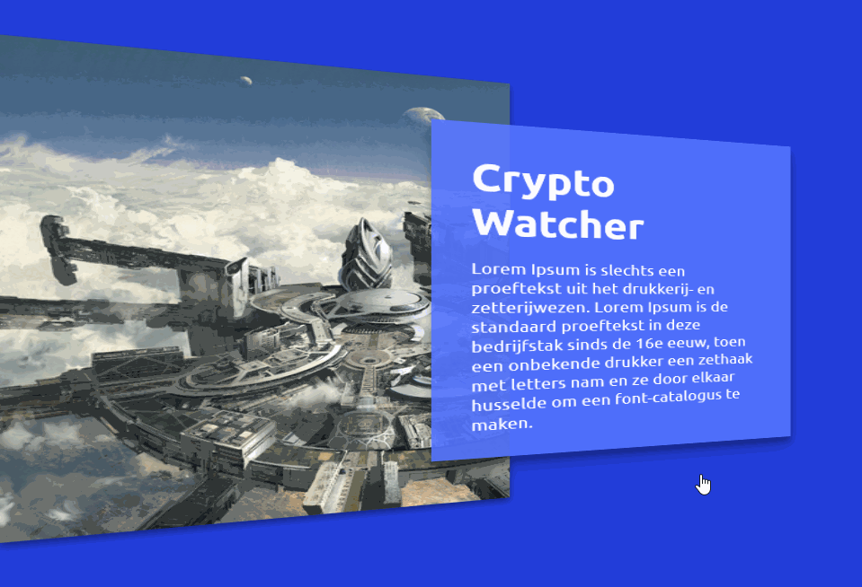

# Portfolio


## Table of contents

- [Description](#description)
- [One primary action per screen](#one_primary_action_per_screen)
- [Appearance follow behavior](#appearance_follow_behavior)
- [Strong visual hierarchies work best](#strong_visual_hierarchies_work_best)
- [Getting started](#getting_started)

## Description
This porfolio is a prototype project where we will create a simple portfolio site that will follow some of the [design principle](http://bokardo.com/principles-of-user-interface-design/) of Joshua porter

The design principle that we will focus on are:
* One primary action per screen
* Appearance follows behavior
* Strong visual hierachies works best

## One primary action per screen
This application has three states. The first stage is a introduction to the site. It gives information what the sites is al about and set the atmosphere for the rest of the site.

On the second state, the focus are on the project.

The last state is the detail page of the project.

<details>
<summary>Click to see: the states</summary>
<p>State one</p>


<p>State two</p>


<p>State three</p>

</details>

## Appearance follow behavior

To let the user know that an element is clickable, a shaduw is addedd to every element that are clickable. When the user hover over the element the shaduw will get bigger.

<details>
<summary>Click to see: demo</summary>
<p>Hovering over a project</p>

</details>

### Feedback
The description don't look clickable. Add a button that says: 'Read more' and make this look like a real button instead.


## Strong visual hierarchies work best

When creating this portfolio, we want to attract the user attention to whats the most important. On the landings page it's the titel of the site. The titel takes the most spaces and attract the user attention really well.

<details>
<summary>Click to see: demo of the landings page</summary>
<p>State one</p>

</details>

And on the detail page, we want to attract the user to the titel of the project and then to the text. To make the titel the first thing that the user looking at, we're going the make the titel really big like the previous example also.

<details>
<summary>Click to see: demo of the detail page</summary>
<p>State one</p>

</details>

## Getting started
Clone repo
```
git clone `https://github.com/niyorn/web-design.git`
```

Change directory to opdracht1
```
cd opdracht1
```

Install all dependencies
```
npm install
```

Start application
```
npm start
```

Standard port is 4000
```
localhost:4000
```

