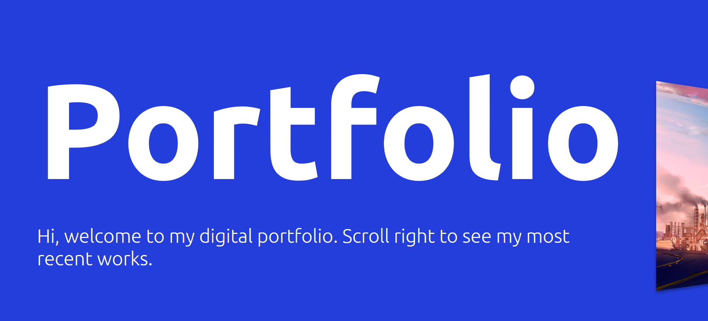
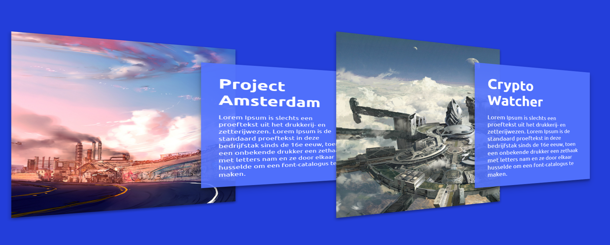
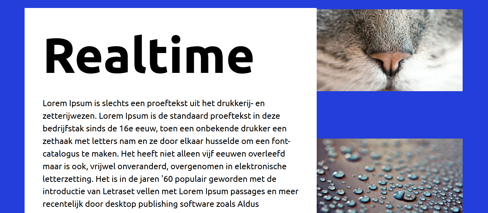

# Portfolio

## Description
This porfolio is a prototype project where we will create a simple portfolio site that will follow some of the [design principle](http://bokardo.com/principles-of-user-interface-design/) of Joshua porter

The design principle that we will focus on are:
* One primary action per screen
* Appearance follows behavior
* Strong visual hierachies works best

## One primary action per screen
This application has three states. The first stage is a introduction to the site. It gives information what the sites is al about and set the atmosphere for the rest of the site.

On the second state, the focus are on the project.

The last state is the detail page of the project.

Click to see: the states

State one

State two

State three

