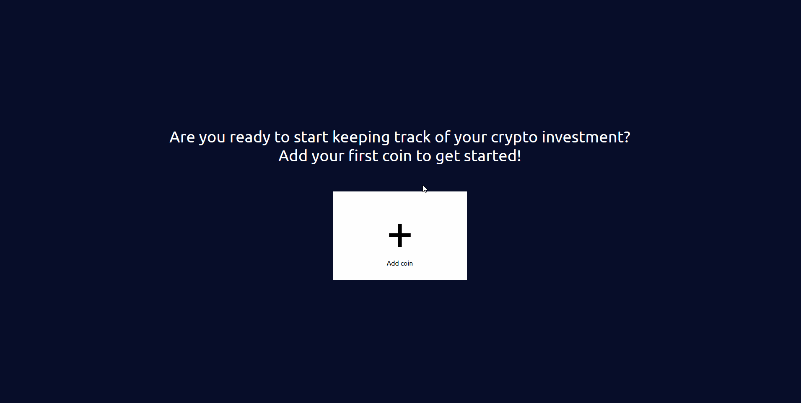
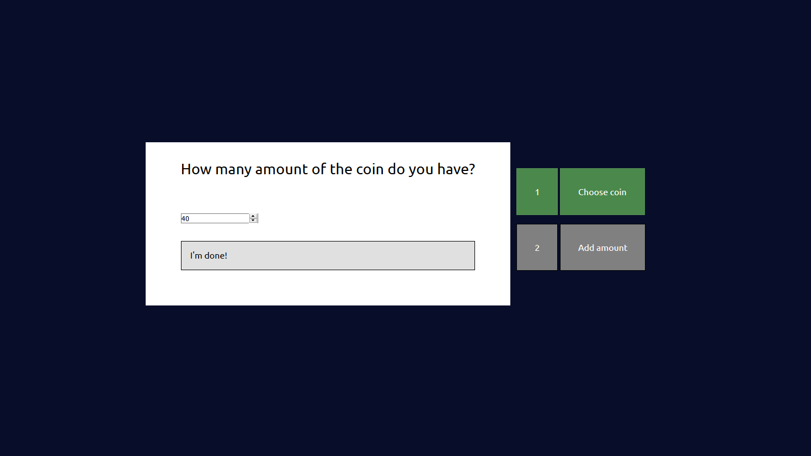
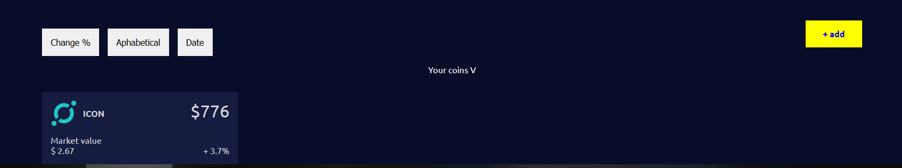
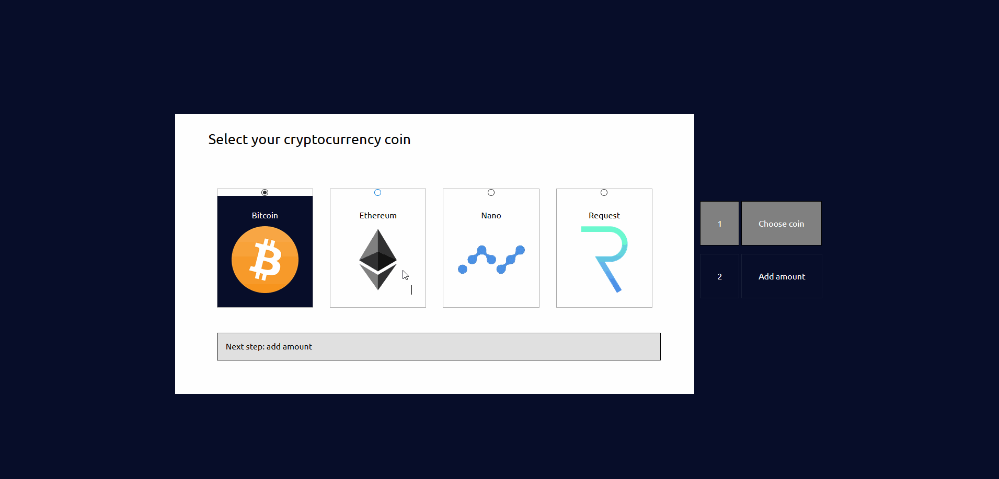
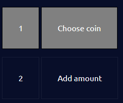
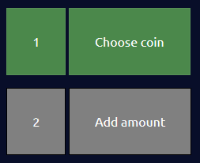
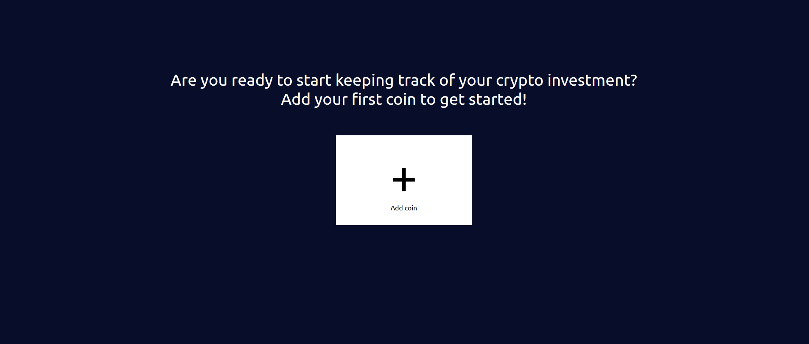
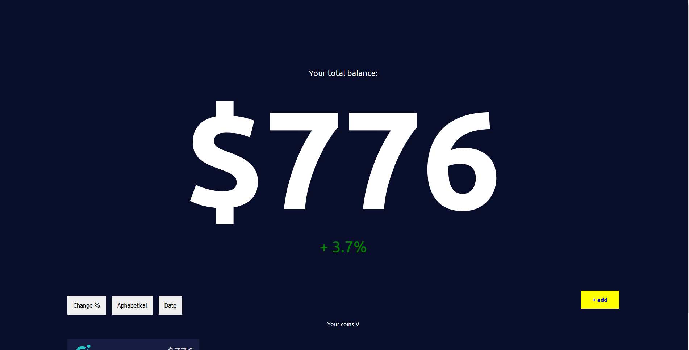
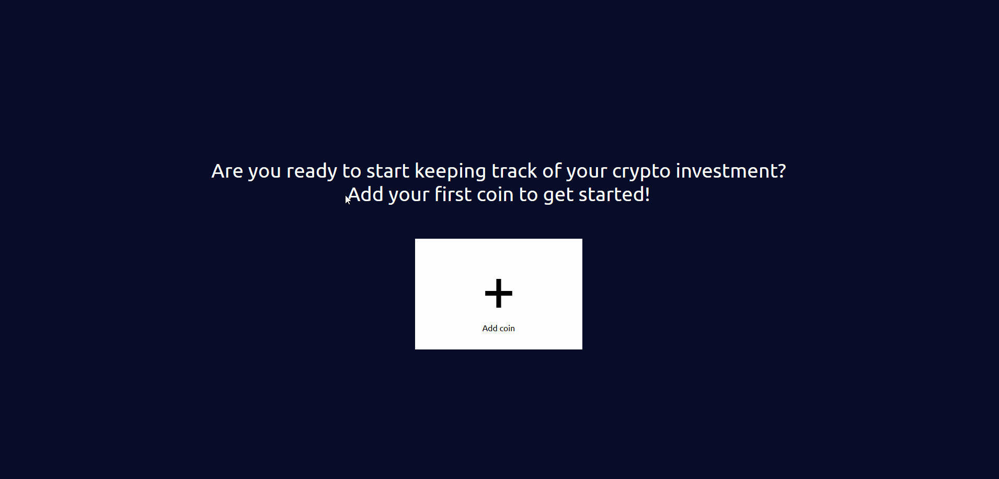
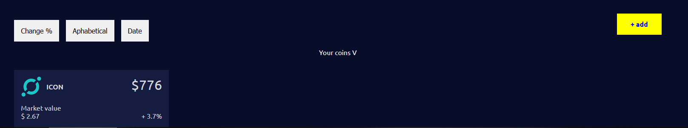

# crypto-wallet

Proof of concept for a Crypto wallet. With this wallet you're able to add your crypto coin to the wallet and see how your investment is  worth in the current market. 

We want to enhance the keyboard experience. Instead of using the standard focus state from the browser, we want to add our own custom focus state that will give the user a clearer feedback where they're focussing on. 

## Table of content
- [Description](#description)
- [User scenario](#user-scenario)
    - [Servin](#servin)
    - [Marijn](#marijn)
- [Focus](#focus)
- [Application version one](#application-version-one)
    - [Focus](#focus-2)
        - [One primary action per screen](#one-primary-action-per-screen)
        - [Progressive disclosure](#progressive-disclosure)
        - [Zero state](#zero-state)
        - [Strong visual hierarchies works best](#strong-visual-hierarchies-works-best)
- [Accessibility](#accessibility)
- [Sorting & Filtering](#sorting--filtering)
- [The test](#the-test)
    - [Insight](#insight)
- [Changes](#changes)

## Description

This application is done for the course 'Web Design' commissioned by the minor Web Development by de Hogeschool van Amsterdam.  In this course we learn to design our application according to the [Design Principle](http://bokardo.com/principles-of-user-interface-design/) by Joshua Porter. And how to test our application.

In this document you'll find an user scenario for the application. My chosen principle that I've decided to focus on and how I've applied it on the application. You'll also find two version of the application, on before the test and one after the test. The second one is the final version where we've improve our application after getting the insight/feedback. 

## User Scenario

*User scenarios help designers understand what motivates users when they interact with a design*

In this user scenario You'll find two person. Both person are interested in investing in the crypto market. One person (Servin) is a student and the other person (Marijn) is an adult that have a disability. 

### Servin

Servin have invested in the crypto market. Servin wants an easy way to able to see the total worth of all of his assets and also the worth of the individual assets.

### Marijn

Marijn have invested in the crypto market, and wants to see the total worth of his assets also. But because of a chronic disease he is unable to use the trackpad.

## Focus

For this project I want focus on the following design principles

- One primary action per screen
- Progressive disclosure
- The zero state
- Strong visual hierarchies works best

## Application version one

This is the first version of the application

### Focus
In this section I'll explain how I've applied the design principles to the application.

#### One primary action per screen

This application got four states. In every states the focus of the user should be on the main function of that state.

The first state: the function of this state is to choose which coin you want to add to your wallet.

The second state: the function of the second state is to add the amount that you have.

The third state: The function of the third state is to see your total value.

The fourth state: the function of the fourth state is to see which coin you've added to your wallet.

Click to see: screenshot of the states

State one

State two

State three

State four

#### Progressive disclosure
I want to achieve progressive disclosure by splitting adding the coin and adding the amount in two parts. 

Also to give the user a sense how many steps they have to take to complete the task, a navigation is added on the right side. The user is also to navigate between the steps by clicking on the navigation.

Click to see: progressive disclosure in action

Progressive disclosure

When a step as been completed that part of the navigation will light up green. The color grey indicate that the user is on that part of the step and has yet to complete the task.

Click to see: images of the navigation

The user is in step 1 and has yet to complete the task
 

Step 1 is completed. The user is now in step 2
 

#### Zero state

When an user comes to our application to the first time, we want to help them out immediately. We've added a zero state to the application so that the user can immediately add coins to their wallet, also this zero state helps the user understand what we expects of them.

Click to see: the zero state

Zero state
 

#### Strong visual hierarchies works best

When the user have completed all the task, they will arrive at the 'main' screen where they will see their total value of their wallet. 
When the the user is on this part of the application, I want their focus to be on the total value. To make this happen I've made the text of the total value really big, so that when they've arrive their focus will be attracted to the big text.

Click to see: hierarchies in action

The total value is made really big
 

## Accessibility

Marijn is unable to use the trackpad so he need to be able to navigate through the site without the trackpad. To achieve this, every part of the application is tab-able. You are able to navigate through the application by using the tab-key on the keyboard.

Because tab is going to be used a lot, a custom focus state is added to application. This is done because the default focus state is not obvious enough. The custom focus state will create a more unique experience by adding our own flair to it, also because it's more obvious which item the user is focussed on, this will additionally create a better user experience. 

Click to see: tab in action

Adding coin to the wallet by tabbing
 

## Sorting & Filtering

When the user have added coins to their wallet. They need a way to sort and filter this. This will give them valuable information like for example: which of their coins is worth the most.

*disclaimer: this functionality doesn't work at the moment. It is just an idea of the things the user is able to sort and filter*

### Sorting
- Alphabetical
- Last added coin
- 24 Hour change
- Worth of asset
- Market Cap
- Total possession per individual asset

### Filtering
- Name
- Favorite

## The test

The application have been tested by Marijn. The video of the test can be found [here](https://vimeo.com/279084453) (video is in dutch). 

The user scenario that Marijn have to go through is that he's an investor in the crypto market and that he wants to add coins to his Crypto Wallet to keep track of it all.

The section below is the insight that is gained after the test.

### insight

- The assumption that we've had was that Marijn cannot use the trackpad. While testing it became clear that was not truth at all. He can use a trackpad just fine, but with a little bit more difficulty that a normal person.
- Zero state should've given the user more options to start with. This way the user know what to do.
- Progressive disclosure can be taken to far. If the task is not complex and if they're the same thing than it's better to have them on the same page.

## Changes

This section gives insight about the improvement that is done to the application after testing. The changes are based on the suggestion that is given by the tested person and from observation.

### Progressive disclosure
