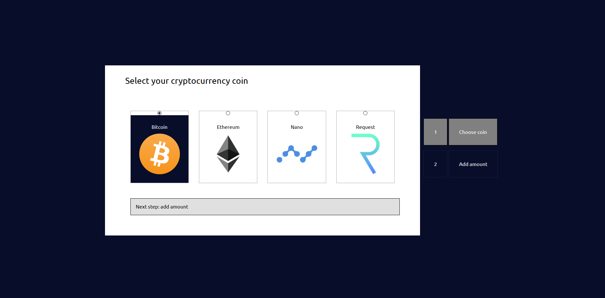

# crypto-wallet

Proof of concept for a Crypto wallet. With this wallet you're able to add your crypto coin to the wallet and see how your investment is  worth in the current market. 

To enhance your experience on this application, we're adding an a way for you to see in a glance how your investment is doing. Your investment font-size will grow or shrink based on the 24 hour changes of the market. Example: If your total coin value increase by 10% than the font-size of your investment will grow by 10% from the base font. So if you're on the the homepage and you see that your investment is displayed really big, than with a glance your just know that your investment is doing good in the current market. - inspired by Sam Gulliker

On top of that, we want to enhance the keyboard experience. Instead of using the standard focus state from the browser, we want to add our own custom focus state that will give the user a clearer feedback where they're focussing on. Also we want to add a transition effect from the current item that you're focussing on to the new item that you've focussed. - inspired by Varsiles
## Table of content
- [Description](#description)
- [User scenario](#user-scenario)
    - [Servin](#servin)
    - [Marijn](#marijn)
- [Focus](#focus)
- [Application version one](#application-version-one)
    - [Focus](#focus-2)
        - [One primary action per screen](#one-primary-action-per-screen)
        - [Progressive disclosure](#progressive-disclosure)
        - [Zero state](#zero-state)
        - [Strong visual hierarchies works best](#strong-visual-hierarchies-works-best)
- Sorting & Filtering
- Version one
- The test
- Changes

## Description

This application is done for the course 'Web Design' commissioned by the minor Web Development by de Hogeschool van Amsterdam.  In this course we learn to design our application according to the [Design Principle](http://bokardo.com/principles-of-user-interface-design/) by Joshua Porter. And how to test our application.

In this document you'll find an user scenario for the application. My chosen principle that I've decided to focus on and how I've applied it on the application. You'll also find two version of the application, on before the test and one after the test. The second one is the final version where we've improve our application after getting the insight/feedback. 

## User Scenario

*User scenarios help designers understand what motivates users when they interact with a design*

In this user scenario You'll find two person. Both person are interested in investing in the crypto market. One person (Servin) is a student and the other person (Marijn) is an adult that have a disability. 

### Servin

Servin have invested in the crypto market. Servin wants an easy way to able to see the total worth of all of his assets and also the worth of the individual assets.

### Marijn

Marijn have invested in the crypto market, and wants to see the total worth of his assets also. But because of a chronic disease he is unable to use the trackpad.

## Focus

For this project I want focus on the following design principles

- One primary action per screen
- Progressive disclosure
- The zero state
- Strong visual hierarchies works best

## Application version one

This is the first version of the application

### Focus
In this section I'll explain how I've applied the design principles to the application.

#### One primary action per screen

This application got four states. In every states the focus of the user should be on the main function of that state.

The first state: the function of this state is to choose which coin you want to add to your wallet.

The second state: the function of the second state is to add the amount that you have.

The third state: The function of the third state is to see your total value.

The fourth state: the function of the fourth state is to see which coin you've added to your wallet.

Click to see: screenshot of the states

State one

State two

State three

State four

#### Progressive disclosure
I want to achieve progressive disclosure by splitting adding the coin and adding the amount in two parts. 

Also to give the user a sense how many steps they have to take to complete the task, a navigation is added on the right side. The user is also to navigate between the steps by clicking on the navigation.

Click to see: progressive disclosure in action

Progressive disclosure

When a step as been completed that part of the navigation will light up green. The color grey indicate that the user is on that part of the step and has yet to complete the task.

Click to see: images of the navigation

The user is in step 1 and has yet to complete the task
 

Step 1 is completed. The user is now in step 2
 

#### Zero state

#### Strong visual hierarchies works best

## Sorting & Filtering

### Sorting
- Alphabetical
- Last added coin
- 24 Hour change
- Worth of asset
- Market Cap
- Total possession per individual asset

### Filtering
- Search
- Favorite
- Possession of assets

## Insight
*The site has been tested by Marijn. This is the insight that is gained after testing*

- Zero state should've given the user more options to start with. This way the user know what to do.
- Progressive disclosure can be taken to far. If the task is not complex and if they're the same thing than it's better to have them on the same page.